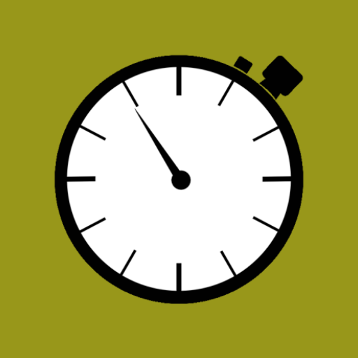
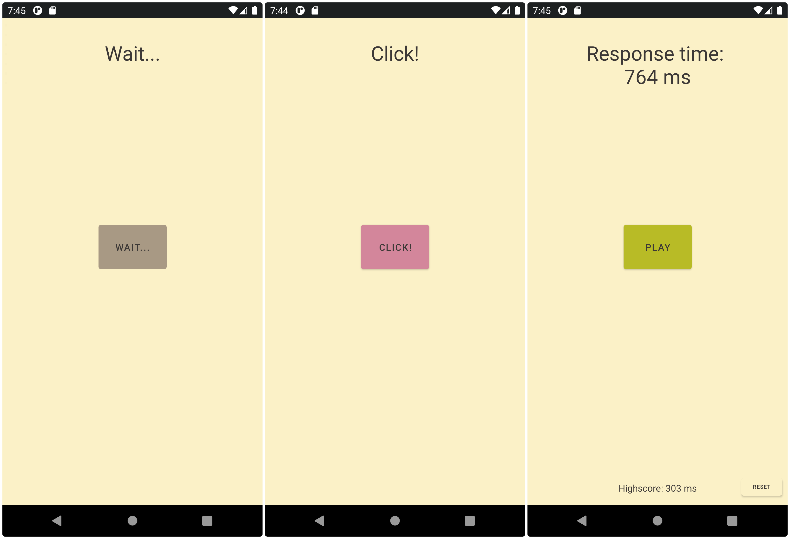

 

  

  <h3 align="center">ReactionTime</h3>
  
simple app to measure your reaction time.

## Screenshots

## Installation
1. Download the [latest release](https://github.com/Kuuhhl/reactionTime/releases/) `.apk` file.
2. Install the `.apk` file.

